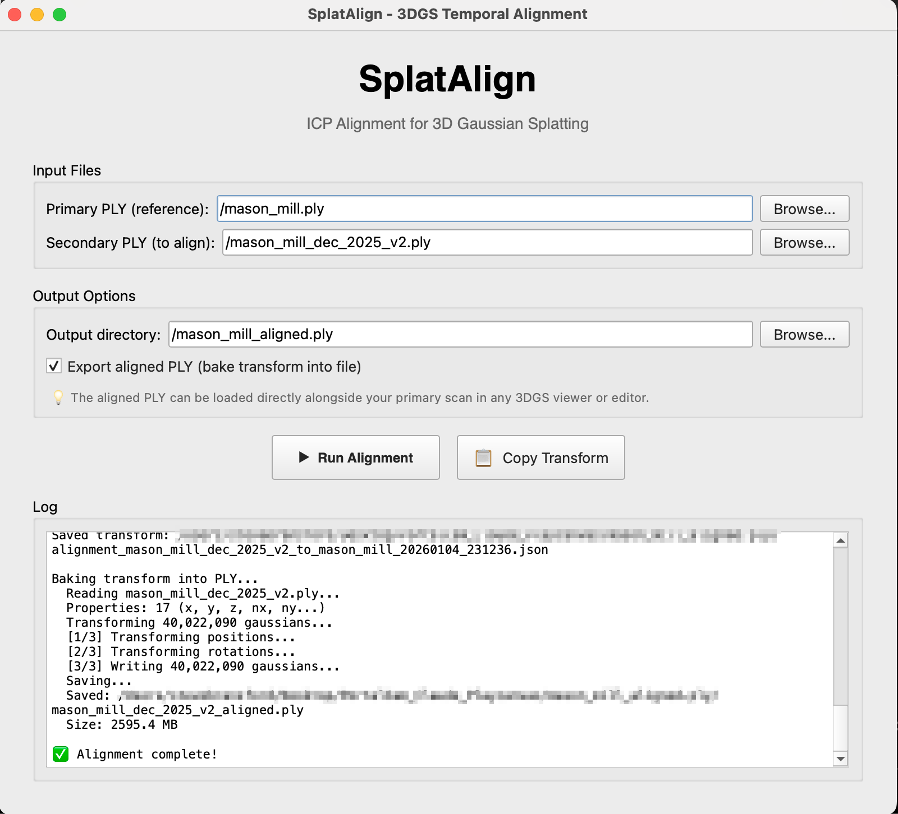

# SplatAlign

**ICP alignment for 3D Gaussian Splatting temporal captures.**

**[Download Mac App](https://github.com/terminusfilms/splatalign/releases/latest)** | Windows coming soon | [Python install](#installation)

Align two 3DGS scans of the same location taken at different times. Get a **4x4 transform matrix** to use in your own code, or export an aligned PLY with the transform baked in.



## Output

- **4x4 Transform Matrix** — Column-major (WebGL/Three.js/PlayCanvas) and row-major (numpy) formats
- **Aligned PLY** *(optional)* — Transform baked into vertex data for viewers that can't apply runtime transforms

## Features

- **Multi-scale ICP** — 4-stage alignment (5m → 1m → 0.3m → 0.1m) handles large initial offsets
- **~5cm accuracy** — Median alignment error suitable for seamless time-toggle switching
- **Ground filtering** — Excludes seasonal vegetation (trees, grass) for stable structural alignment
- **GUI + CLI** — PyQt6 interface or command-line automation

## Why Baked PLY?

Some 3DGS viewers (like Virtual Tour Pro) can't apply runtime transforms. The optional baked PLY export solves this — positions and rotations are transformed, all other properties preserved. Load the aligned PLY alongside your primary scan in any viewer.

## Installation

**Requirements:** Python 3.8+

```bash
git clone https://github.com/terminusfilms/splatalign.git
cd splatalign
python3 -m venv .venv
source .venv/bin/activate  # Windows: .venv\Scripts\activate
pip install -r requirements.txt
```

## Usage

### GUI Mode

```bash
python splat_align.py
```

1. Select **Primary PLY** (reference scan — usually your first capture)
2. Select **Secondary PLY** (scan to align — your later capture)
3. Check "Export aligned PLY" to bake the transform
4. Click **Run Alignment**
5. Use the aligned PLY directly, or copy the transform matrix

### CLI Mode

```bash
# Transform matrix only
python splat_align.py --cli primary.ply secondary.ply

# With baked PLY output
python splat_align.py --cli primary.ply secondary.ply --bake

# Custom output directory
python splat_align.py --cli primary.ply secondary.ply --bake /path/to/output
```

## Output

### Aligned PLY File

`secondary_aligned.ply` — Ready to load alongside your primary in any viewer. Positions and quaternion rotations are transformed; colors, scales, and spherical harmonics preserved.

### Transform JSON

```json
{
  "quality": {
    "mean_cm": 5.23,
    "median_cm": 4.89,
    "p90_cm": 8.12,
    "inlier_pct": 94.2
  },
  "matrix_column_major_flat": [0.93, 0.36, -0.02, 0.0, ...],
  "matrix_row_major": [[...], [...], [...], [...]]
}
```

### Using Transforms in Code

**PlayCanvas / Three.js (column-major):**
```javascript
// PlayCanvas config.js
transforms: {
    oct2025: null,  // Primary, no transform
    dec2025: [0.93, 0.36, -0.02, 0.0, ...]  // Paste matrix_column_major_flat
}

// Three.js
const matrix = new THREE.Matrix4();
matrix.fromArray(result.matrix_column_major_flat);
mesh.applyMatrix4(matrix);
```

**Python/numpy (row-major):**
```python
import numpy as np
T = np.array(result['matrix_row_major'])
aligned_points = (T[:3,:3] @ points.T).T + T[:3,3]
```

## How It Works

1. **Load PLY** — Extract XYZ positions from 3DGS vertex data
2. **Sample & Filter** — Random sample + bottom 40% Z (ground/structure only)
3. **Multi-scale ICP** — Iterative Closest Point at decreasing distance thresholds
4. **Quality metrics** — Mean, median, 90th/95th percentile errors
5. **Export** — Transform matrix JSON + optionally baked PLY

### Ground Filtering

Seasonal changes (foliage, grass) create noise for alignment. By filtering to the bottom 40% of Z values, SplatAlign focuses on stable structural elements — paths, buildings, rocks — that don't change between captures.

## Building Standalone App

For distribution without Python:

```bash
pip install pyinstaller
pyinstaller --onefile --windowed --name SplatAlign splat_align.py
```

Creates `dist/SplatAlign.app` (macOS) or `dist/SplatAlign.exe` (Windows).

## Use Cases

- **Time-toggle viewers** — Switch between temporal states at the same camera position
- **Seasonal documentation** — Gardens, landscapes, construction progress
- **Before/after** — Renovations, events, environmental change
- **Multi-capture fusion** — Combine overlapping scans from different sessions

## Next Steps: Build a Viewer

Once you have your aligned splats, use the **[Splat Time Toggle Template](https://github.com/terminusfilms/splat-time-toggle-template)** to build an interactive web viewer:

1. Clone the template
2. Add your LOD-converted splats
3. Paste your `matrix_column_major_flat` into `config.js`
4. `npm run dev`

The template includes WASD navigation, mobile support, time toggle UI, and optional collision.

### Memory Considerations

Displaying multiple aligned splats simultaneously (for toggling or comparison) requires loading all splats into GPU memory. For large captures:

- **LOD streaming** (recommended) — Convert splats to hierarchical LOD format using [@playcanvas/splat-transform](https://www.npmjs.com/package/@playcanvas/splat-transform). Only visible detail levels load, enabling multi-gigabyte scenes on standard hardware.
- **Compressed splats** — Formats like SOG (Sorted Gaussians) can reduce file sizes significantly, making multiple smaller splats feasible without LOD. Best for compact scenes under ~10M gaussians each.

## Credits

Developed by [Steve Bransford](https://github.com/terminusfilms).

Part of the [Atlanta Space Machine](https://atlantaspacemachine.com) project — aerial-to-ground 3DGS exploration of Atlanta landmarks.

Alignment pipeline proven on PortalCam (XGRIDS) captures of Mason Mill ruins, achieving ~5cm median accuracy across seasonal changes.

## License

MIT License — see [LICENSE](LICENSE)
